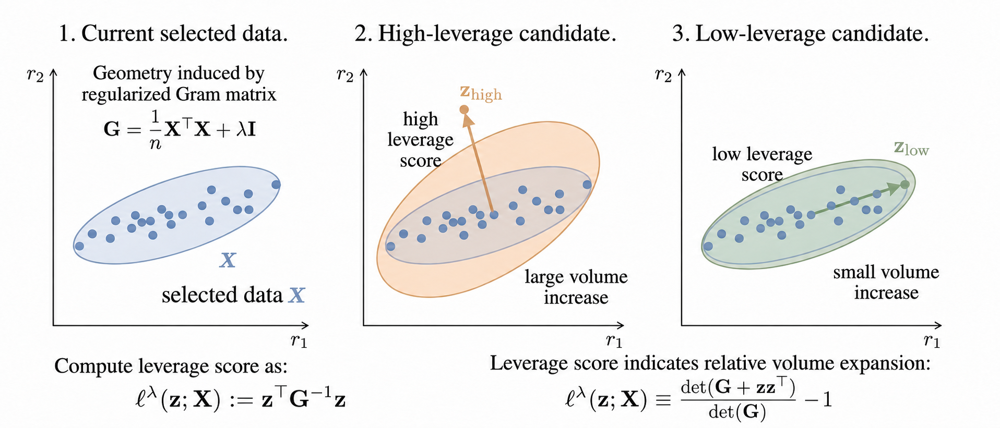
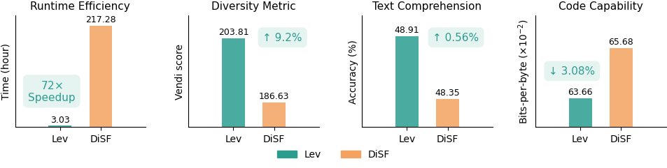

# Towards Scalable Data Diversification for Language Model Pretraining via Leverage Score Sampling

<!-- <h4> |<a href="https://arxiv.org/abs/1111.11111"> 📑 Paper </a> | -->

## Overview

### Motivation 
Quality filtering is the dominant paradigm for data selection in LLM pretraining, yet it suffers from *dimensional collapse*: classifiers trained on narrow reference corpora (e.g., educational QA texts) systematically discard valuable out-of-domain data, causing the filtered dataset to concentrate in a low-dimensional subspace of the embedding space. Diversified selection is a natural remedy, but existing methods either target distributional coverage rather than geometric diversity, or incur prohibitive computational costs from iterative covariance matrix recomputation (e.g., DiSF). These limitations motivate us to seek an alternative geometric objective that directly spans the representation subspace without repeated covariance tracking.

### Method
We propose **Leverage Score Sampling (Lev)**, a scalable scheme that employs leverage scores as a principled metric for diversity improvement. Grounded in the geometric insight that dataset diversity corresponds to the determinantal volume of the representation subspace spanned by embedded samples, we prove a theorem showing that the leverage score of a candidate exactly quantifies its contribution to expanding this volume upon inclusion in the selected subset (Theorem 3.1). Building on this result, Lev iteratively selects samples with the highest leverage scores to directly maximize geometric diversity. Unlike DiSF, which requires costly covariance matrix recomputation for each candidate to evaluate its marginal diversity contribution, Lev evaluates all candidates via quadratic expressions with a single shared Gram matrix, achieving superior computational efficiency and enabling scalable applications.



### Main Results
- Lev shows superior computational efficiency, enabling scalable diversified sampling. It improves dataset diversity (measured by Vendi score) by 9.2\% while achieving a **72$\times$ runtime speedup** compared to the strong *diversification baseline DiSF*. 
- Moreover, it outperforms existing diversity-based selection methods on downstream performance of the pretrained models. On CommonCrawl (CC) web data subset selection, it improves average accuracy across seven downstream tasks by up to 1.31% over existing baselines. 
- Crucially, Lev requires no curated quality references, making it uniquely effective for domains where defining quality is inherently ambiguous, e.g., code data: on StarCoderData, it reduces model's bits-per-byte by 3.08% over DiSF. 
- Using 8 RTX 5090 GPUs that process 8 files in parallel, **selecting 40%** data from **a single CommonCrawl dump (~200B token)** with a step size of 2 requires only about 1.67 hours compared to 108.48 hours of DiSF, confirming a 72$\times$ speedup. With a step size of 8, **Lev consumes only about 35 min** compared to 26.88h of DiSF.



## Usage

Lev selection consists of two steps: **embedding computation** and **leverage score selection**.

### Step 1: Compute Embeddings

The input corpus should contain original data in JSONL format. After running this step, the output directory will hold the corresponding embedding files, e.g.:

```
corpus/
├── data/
│   ├── 00000.jsonl
│   ├── 00001.jsonl
│   └── ...
└── embed/          <-- output of Step 1
    ├── 00000.embedding
    ├── 00001.embedding
    └── ...
```

- **`data/`** — Contains JSONL files named `{file_id:05d}.jsonl`. Each line in the JSONL file is a dictionary with at least a `text` field holding the document text. The document ID starts from 0 for the first line and increments sequentially.
- **`embed/`** — Output of this step. Each `{file_id:05d}.embedding` corresponds to `{file_id:05d}.jsonl`, storing the embedding vectors sequentially in binary float32 format — the *i*-th vector in the file is the embedding of the *i*-th document in the matching JSONL.

First, launch an embedding model server (e.g., deploy Qwen3-Embedding-0.6B via vLLM on an 8×RTX 5090 machine):

```bash
vllm serve /models/Qwen3-Embedding-0.6B -dp 8 --gpu-memory-utilization 0.9 --task embed --enforce-eager --disable-custom-all-reduce
```

Then run the embedding script:

```bash
python embed.py \
    --model /models/Qwen3-Embedding-0.6B \
    --input_dir /path/to/corpus/data \
    --output_dir /path/to/corpus/embed \
    --batch_size 2048 \
    --max_length 512 \
    --workers 10
```

Key arguments:
- `--input_dir`: Directory containing JSONL files (each line must have a `text` field)
- `--output_dir`: Output directory for `.embedding` files (preserves input directory structure)
- `--max_length`: Maximum token length for truncation (default: 1500)
- `--workers`: Number of parallel worker processes (default: 10)

### Step 2: Leverage Score Selection

```bash
python select_file_gpu.py \
    --embed_folder /path/to/corpus/embed \
    --output_dir /path/to/selection_output \
    --embed_dim 1024 \
    --strategy lev \
    --selection_ratio 20 \
    --step_size 2 \
    --batch_size 1024
```

Key arguments:
- `--embed_folder`: Directory containing the `.embedding` files from Step 1
- `--output_dir`: Output directory for `.index` files (each line is a selected document index)
- `--embed_dim`: Embedding dimension (default: 1024)
- `--strategy`: Selection strategy — `lev` for Leverage Score Sampling, `random` for random baseline (default: `lev`)
- `--selection_ratio`: Selection ratio in percentage, e.g., `20` for 20%, or `20,30,40` for multiple ratios (default: `20`)
- `--step_size`: Number of samples selected per iteration in Lev (default: `2`)
- `--batch_size`: Pool size for each local selection round (default: `1024`)

The algorithm is not sensitive to step size (e.g., stepsize=2,4,8,12,16) or batch size (e.g., batchsize=512,1024,2048,4096).

The output `.index` files record the line indices of selected documents in each source JSONL file, ready for downstream data extraction. The output directory will have the following structure:

```
selection_output/
└── lev_20_2_1024/              <-- {strategy}_{ratio}_{step_size}_{batch_size}
    ├── index/                  <-- output of Step 2
    │   ├── 00000.index
    │   ├── 00001.index
    │   └── ...
    └── log/
```

- **`index/`** — Output of this step. Each `{file_id:05d}.index` corresponds to `{file_id:05d}.jsonl`, where each line is an integer indicating the ID of a selected document.


